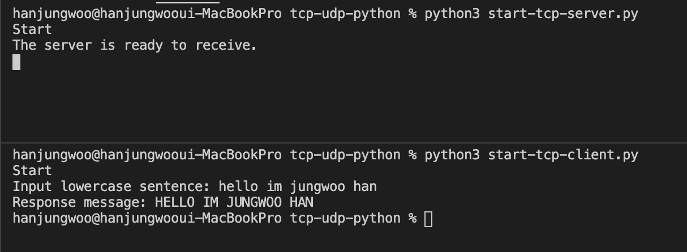
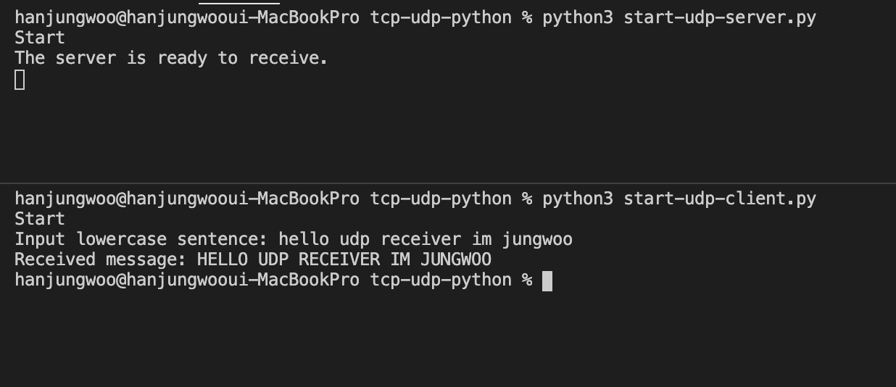

# tcp-udp-python

## TCP test



위에 터미널이 테스트 TCP 서버를 실행시킨 터미널

```
python3 start-tcp-server.py
````

아래 터미널이 테스트 TCP 클라이언트를 실행시킨 터미널

```
python3 start-tcp-client.py

```

## UDP test



위에 터미널이 테스트 UDP 서버를 실행시킨 터미널

```
python3 start-udp-server.py
````

아래 터미널이 테스트 UDP 클라이언트를 실행시킨 터미널

```
python3 start-udp-client.py
```
